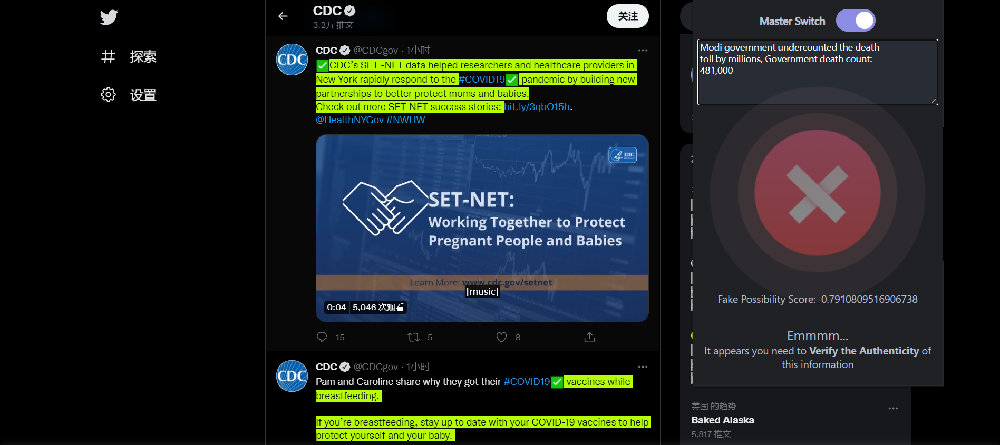

<div id="top"></div>

<!-- ABOUT THE PROJECT -->
## Worthiness Checker



Our project is a Chrome Extension for Checkworthy Tweet Detection. We built this extension to help users distinguish the truth from fake information on social media. 
<br>

Reason why we picked Chrome extension as a platform:
* A natural place of using text information retrieval techniques
* Efficient way to demonstrate outcomes
* Generality and easy to interact with web pages

<br>
Social Media can be one of the most significant carriers of information that handles a great extent of information exchange in our daily lives. However, false and deceptive information could slip in and take advantage of the effectiveness of Social Media to spread widely and cause massive harm to users with no means to tell the worthiness of info. Thus, it is critical to provide each user a way to deterministically find out the authenticity of posts and news on social media.


<p align="right">(<a href="#top">back to top</a>)</p>


<!-- GETTING STARTED -->
## Getting Started

Our project mainly consists of two parts: the "Front-end" Chrome extension and the Back-end server based on Python Flask.
To get a local copy up and running follow these simple example steps.

### **Dependencies**

We have used backend `app.py` to handle API requests, to install dependencies for running, simply locate to our project folder and do
* pip install
  ```sh
  pip3 install -r ./ExLab/requirements.txt
  ```

### Running the local server

_Below is an example of how you can instruct your audience on installing and setting up your app. This template doesn't rely on any external dependencies or services._

1. Make sure you have installed **Dependencies** in the previous step
2. Make sure you are located our project folder where the following folders exist:
   - `./ExLab`
   - `./extension`
3. Enter the folder `Exlab` using
   ```sh
   cd ./ExLab
   ```
4. Start the server using
   ```sh
   python3 app.py
   ```

<p align="right">(<a href="#top">back to top</a>)</p>


<!-- USAGE EXAMPLES -->
## Usage

Use this space to show useful examples of how a project can be used. Additional screenshots, code examples and demos work well in this space. You may also link to more resources.

_For more examples, please refer to the [Documentation](https://example.com)_

<p align="right">(<a href="#top">back to top</a>)</p>


<!-- ROADMAP -->
## Roadmap

- [x] Add Changelog
- [x] Add back to top links
- [ ] Add Additional Templates w/ Examples
- [ ] Add "components" document to easily copy & paste sections of the readme
- [ ] Multi-language Support
    - [ ] Chinese
    - [ ] Spanish

See the [open issues](https://github.com/othneildrew/Best-README-Template/issues) for a full list of proposed features (and known issues).

<p align="right">(<a href="#top">back to top</a>)</p>


<!-- CONTRIBUTING -->
## Contributing

Contributions are what make the open source community such an amazing place to learn, inspire, and create. Any contributions you make are **greatly appreciated**.

If you have a suggestion that would make this better, please fork the repo and create a pull request. You can also simply open an issue with the tag "enhancement".
Don't forget to give the project a star! Thanks again!

1. Fork the Project
2. Create your Feature Branch (`git checkout -b feature/AmazingFeature`)
3. Commit your Changes (`git commit -m 'Add some AmazingFeature'`)
4. Push to the Branch (`git push origin feature/AmazingFeature`)
5. Open a Pull Request

<p align="right">(<a href="#top">back to top</a>)</p>


<!-- CONTACT -->
## Contact

Name - [@twitter](https://twitter.com/your_username) - email@email.com

Project Link: [https://github.com/vn-sg/510_course_project](https://github.com/vn-sg/510_course_project)

<p align="right">(<a href="#top">back to top</a>)</p>
